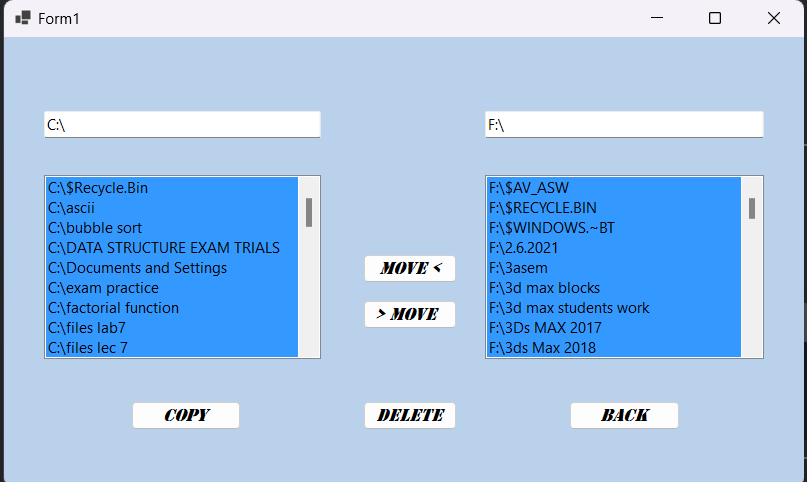

# Files Manager App


A simple and intuitive file management application to organize, upload, and delete files and folders.

---

## Description
The **Files App** is a Desktop-based application designed to help users manage their files and folders efficiently. It provides a user-friendly interface for uploading, organizing, and deleting files. Whether you're managing personal documents or collaborating on a project, this app simplifies file management.

---

## Features
- **File Copy**: Easily copy files from your drive to another drive.
- **File transfer**: Easily transfering files from location to another 
- **File/Folder Deletion**: Delete files or folders with a single click.
---

## Screenshots
  

---
## Installation
Follow these steps to set up the project locally:

1. **Clone the repository**:
   ```bash
   git clone https://github.com/username/repository-name.git
